# Web Programming HW#1

### 作業要求
1. 畫面配置
* 在畫⾯上的中間與左/上部分顯⽰被 anchored 的「主畫⾯」，正中央有個圓顯⽰主畫⾯的使⽤者名稱或是頭像，右上⾓顯⽰是否靜⾳，左下⾓顯⽰此畫⾯已被 anchored 以及使⽤者名稱 。

* 右邊顯⽰五個其他的會議參與者。每位參與者畫⾯的中間有個圓顯⽰使⽤者的名稱或是頭像，右上⾓顯⽰是否靜⾳，左下⾓顯⽰使⽤者名稱。

* 下⽅的資訊/功能由左⾄右依序顯⽰時間、會議名稱、⼀些功能按鈕、⼀些會議資訊按鈕等。
    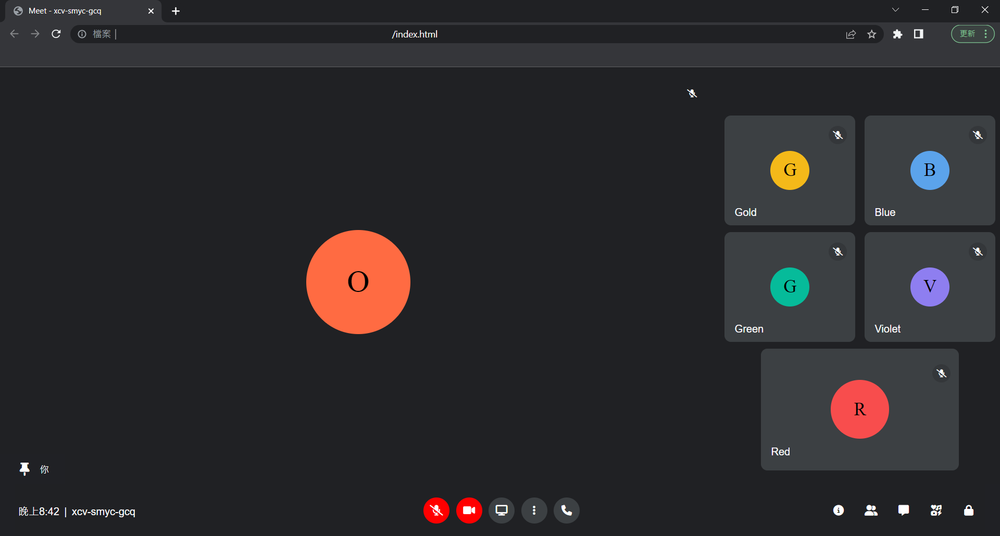
  

2. HTML element
* 主畫⾯、中間的圓、右上與左下的資訊，皆應為不同的 HTML elements。

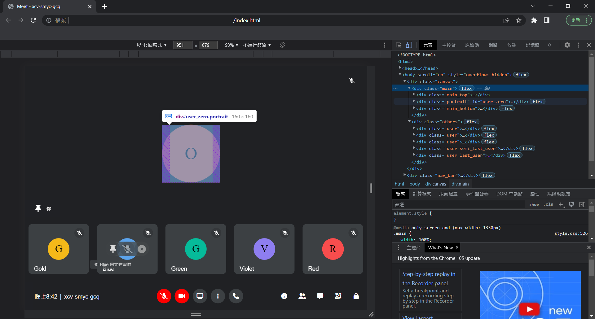 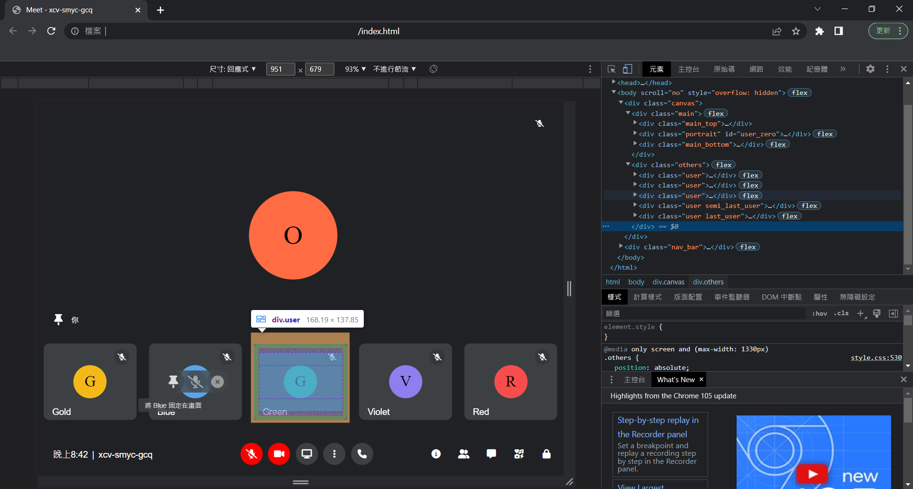 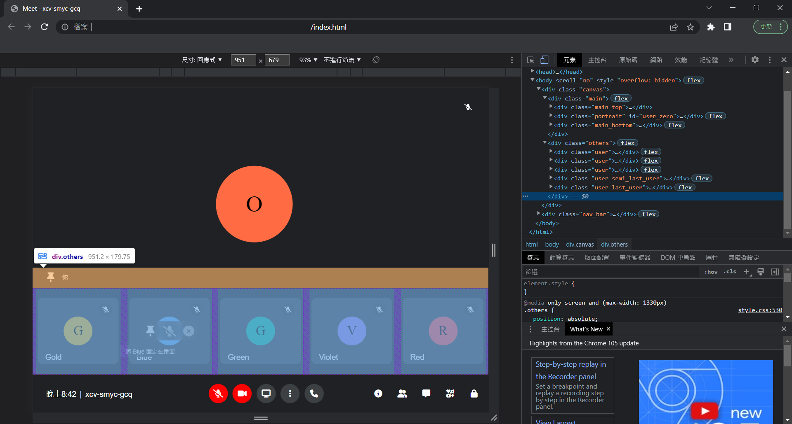
  

3. 功能按鈕
* 當滑鼠游標進入(hover)主畫⾯時，中間的圓會浮現出三個額外的功能按鈕，並以⼀個半透明的橢圓形包覆起來，⽽當游標進入此橢圓時，則此時橢圓形的透明度會降低(顏⾊變深)。

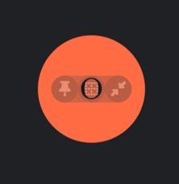 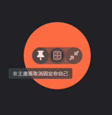
  

### 進階功能
1. 當游標滑⾄每個功能按鈕之上(hover)時，會在功能按鈕上⽅顯⽰此功能之提⽰。包含頭像前功能鍵、正下方按鈕、右下方功能。
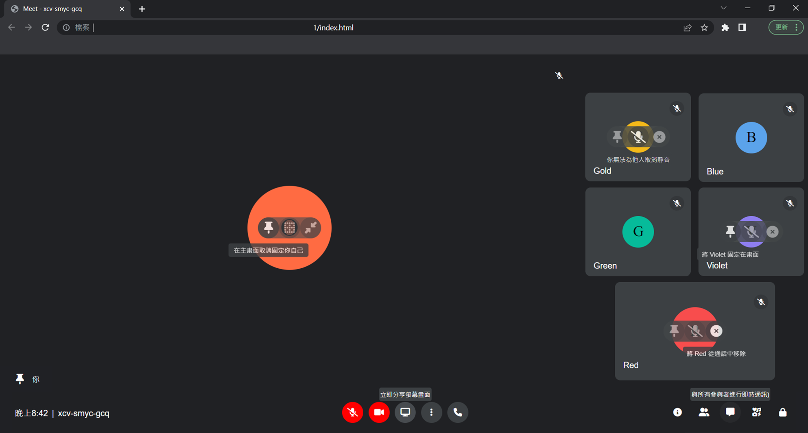
  

2. 點擊靜⾳按鈕時，可以切換靜⾳/無靜⾳與開啟/關閉攝像頭。開啟麥克風時，主頭像上方的靜音標示消失。
 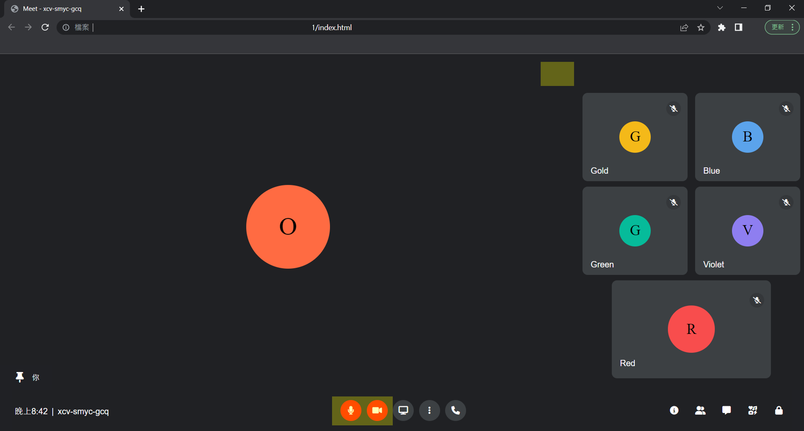
  

3. 做到「Responsive Webb Design (RWD)」，讓網⾴在放⼤、縮⼩時排版不⾄於亂掉，⽽仍保有原來完整的功能。網頁支援在一般筆電螢幕上縱向或橫向的拉伸(僅單方向)。

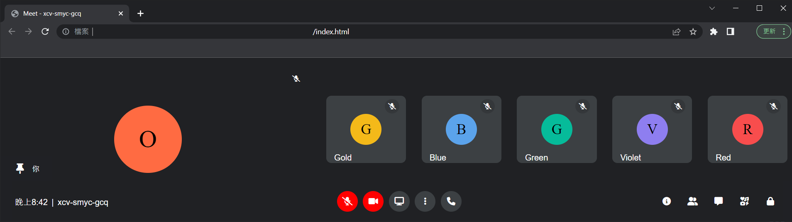  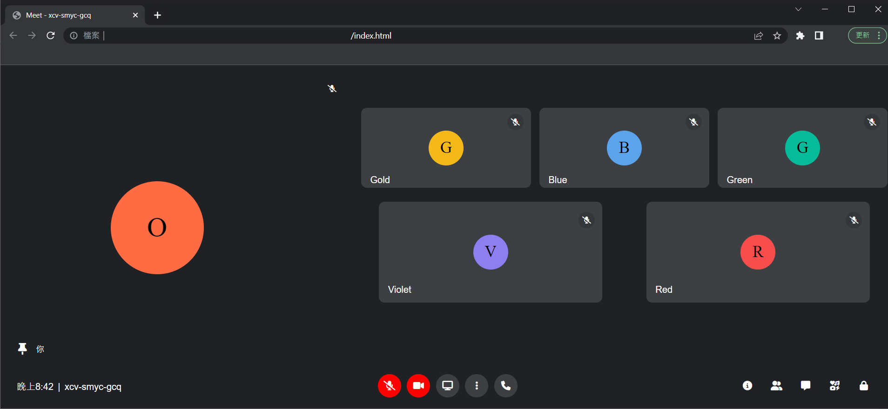 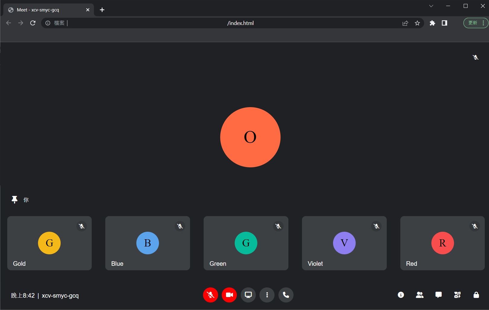 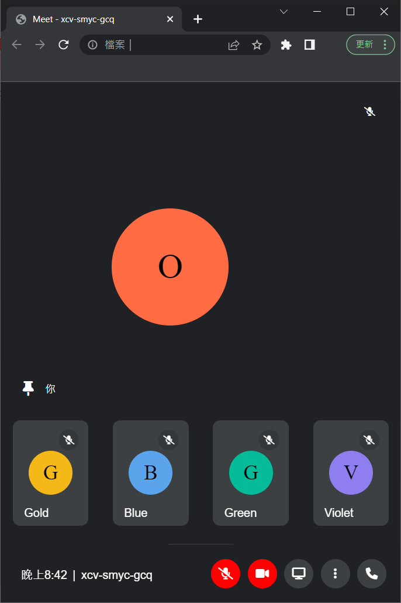