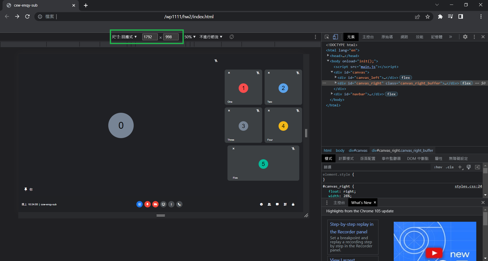
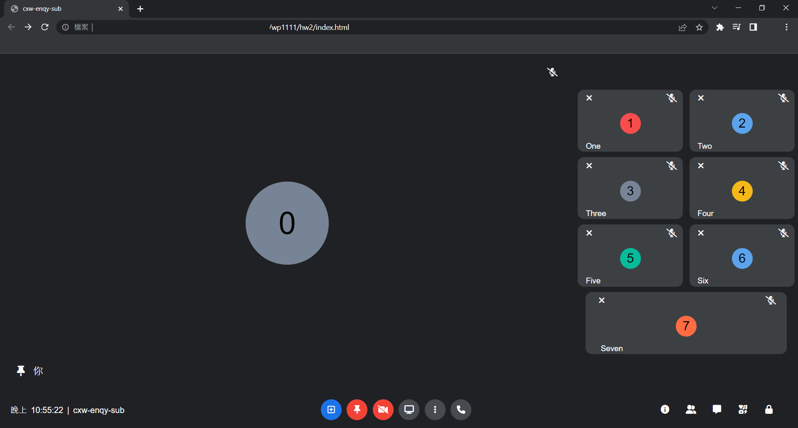

# Web Programming HW#2

### 最佳呈現螢幕大小
* 1792px * 998px (可在瀏覽器按右鍵 > 檢查 調整尺寸)

    
      

### 作業要求
1. 初始畫面為6為參與者

2. 點籍視窗右上角 'X' 符號可將參與者移除畫面
     
      

3. 點選中間浮現的功能按鈕可將小視窗切換至主畫面
     
      

4. 承3，若功能按鈕對應者為主畫面，則主畫面縮為小視窗
     
      

### 進階功能
1. 點擊視窗正下方之藍色 '+' 按鈕可增加參與會議人數。所有參與者以數字標示，順序加入。支援使用者人數 [1,15]
    
      

2. 在側邊攔及整個視窗依參與人數調整視窗比例長寬
      
      
      
      

3. 左下角顯示為即刻 GMT+8 時間