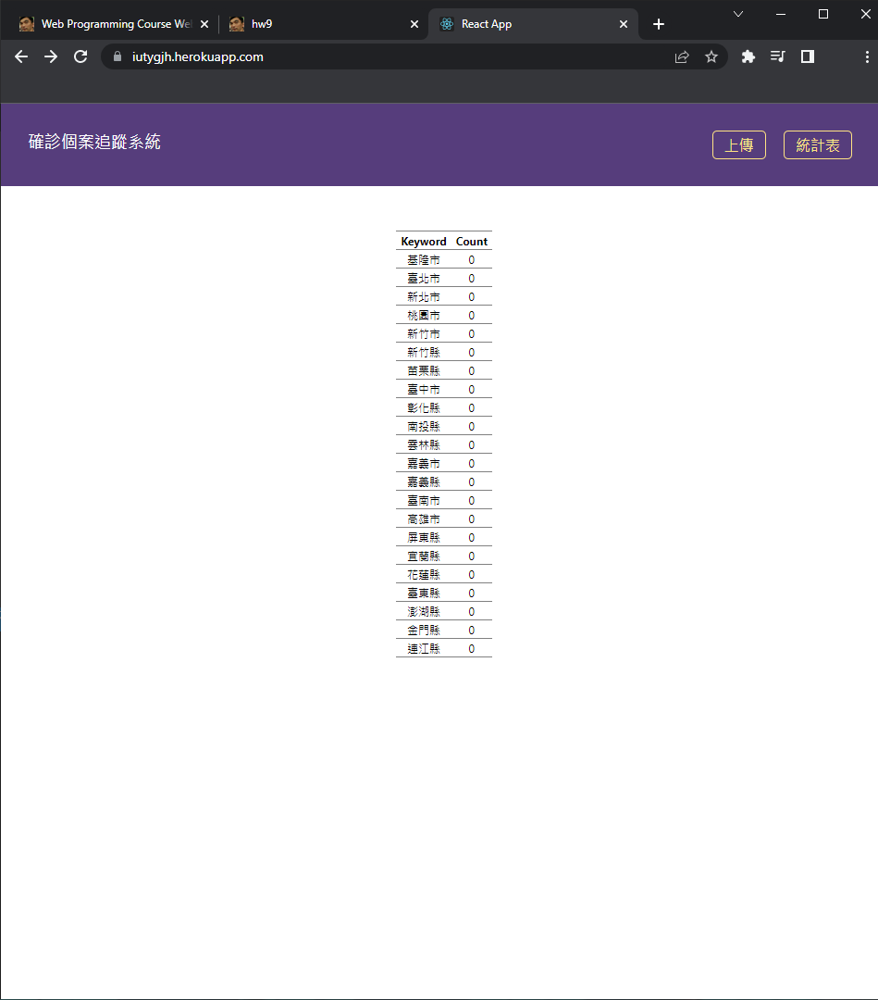
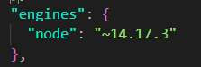

b# Web Programming HW#9
網址: https://iutygjh.herokuapp.com/

網頁來自110-1-Deployment-Tutorial.pdf 中所提供的 github repo

*統計表顯示* 確診個案追蹤結果\
*上傳* 可上傳檔案

deployment 步驟請參考pdf檔

### 遇到的困難與解決方法
按照助教提供的步驟進行deploy會出現error:
> Error: error:0308010C:digital envelope routines::unsupported

上網查了一下推測可能是 node version 的問題，在 package.json 中加上

問題就解決了